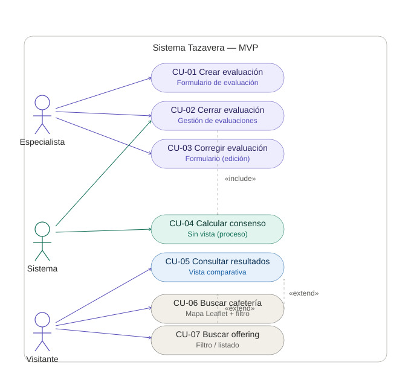

# Tazavera — Casos de uso (MVP reducido bootcamp)

> Alcance de arranque del MVP reducido: foco en **generar evaluaciones** con los roles **specialist** y **coffeeshop**. Locations, coffees, offerings y la evaluación CVA de la cafetería se crean por **seeder**. Consumer, gestión de catálogo/locations/offerings y cierre automático quedan en backlog (ver `proyecto-mvc-laravel-ideas.md`).
>
> **Estado real de implementación (no todo lo de abajo está construido):** CU-01/02/03 (crear/cerrar/corregir evaluación) sí están implementados, sin el plazo de 25 min descrito (no hay timer ni lógica de expiración en el código — cerrar es una acción manual sin límite de tiempo). CU-04 solo calcula el **consenso**; la **concordancia (Kendall's W) no está implementada** (`offerings.concordance`/`concordance_level` existen como columnas pero nada las calcula todavía), y el consenso se dispara solo al **crear** una evaluación (`store()`), no al cerrarla vía `update()`. CU-05/06/07 (vistas de consulta/filtro) están construidas de forma distinta a como se describe aquí — ver el código en `resources/views/layouts/offerings/` y `resources/views/layouts/evaluations/`.
>
> **Estructura de cada caso:** ID y nombre · Actor · Precondiciones · Flujo principal · Flujos alternativos · Postcondiciones.

## Resumen

| ID | Nombre | Actor | Opcional |
|---|---|---|---|
| CU-01 | Crear evaluación | Especialista | No |
| CU-02 | Cerrar evaluación | Especialista / Sistema | No |
| CU-03 | Corregir evaluación | Especialista | No |
| CU-04 | Calcular consenso y concordancia | Sistema | No |
| CU-05 | Consultar resultados del offering | Cualquiera (sin login) | No |
| CU-06 | Buscar cafetería (mapa) | Cualquiera (sin login) | **Sí** |
| CU-07 | Buscar/filtrar offering | Cualquiera (sin login) | **Sí** |

## Diagrama de casos de uso

> Actores (Especialista, Sistema, Visitante) y los siete casos con su vista asociada. Relaciones: CU-02 `«include»` CU-04 (cerrar dispara el cálculo); CU-07 `«extend»` CU-05 (al clicar una card se consultan resultados); CU-06 `«extend»` CU-07 (el mapa lleva al filtro prefiltrado).

---

## CU-01 — Crear evaluación

- **Actor:** Especialista
- **Precondiciones:** El especialista está autenticado; existe el offering (creado por seeder).
- **Flujo principal:**
  1. El especialista selecciona un offering.
  2. El sistema presenta el formulario de evaluación (descriptive + affective).
  3. El especialista completa los ejes de intensidad, las catas y los main_tastes (descriptive), y la parte de calidad/defectos (affective). Sin límite de tiempo durante la cata.
  4. El especialista guarda la evaluación.
  5. El sistema valida los datos según el rol, crea la evaluación en estado `open` y registra en el backend la hora de inicio del plazo de corrección.
- **Flujos alternativos:**
  - 5a. Datos incompletos o inválidos → el sistema muestra el error y no guarda.
- **Postcondiciones:** Existe una nueva evaluación asociada al offering y al especialista, en estado `open`; el plazo de corrección (25 min) queda en marcha desde este primer guardado.

---

## CU-02 — Cerrar evaluación

- **Actores:** Especialista (cierre manual) / Sistema (cierre automático — *opcional*).
- **Precondiciones:** Existe una evaluación `open` del especialista.
- **Flujo principal (manual):**
  1. El especialista, desde la vista de gestión de evaluaciones, solicita cerrar una evaluación propia.
  2. La petición llega a una **ruta** que invoca el **controlador** de cierre.
  3. El controlador cambia el status a `closed` y llama directamente al cálculo (CU-04).
- **Flujo alternativo (automático) — *opcional, en backlog*:**
  - El **Laravel Scheduler** ejecuta periódicamente un comando que busca evaluaciones `open` con 25 min cumplidos desde el primer guardado y las cierra, invocando la misma lógica de cierre + cálculo. El primer MVP arranca solo con cierre manual.
- **Postcondiciones:** Evaluación `closed` e inmutable; cálculo del offering disparado.
- **Nota:** ambas vías de cierre (controlador y scheduler) invocan una lógica de cierre + cálculo **centralizada** (servicio compartido) para no duplicar.

---

## CU-03 — Corregir evaluación

- **Actor:** Especialista (autor).
- **Precondiciones:** Existe una evaluación **propia** en estado `open`, dentro del plazo de 25 min y sin cierre manual previo.
- **Flujo principal:**
  1. El especialista accede a su evaluación abierta.
  2. El sistema presenta el formulario con los datos actuales.
  3. El especialista ajusta los valores (corrección por la bajada de temperatura).
  4. Guarda los cambios.
  5. El sistema valida y actualiza la evaluación (permanece `open`).
- **Flujos alternativos:**
  - 1a. La evaluación ya está `closed` (cierre manual o expiración de los 25 min) → el sistema no permite editar.
  - 5a. Datos inválidos → muestra error, no guarda.
- **Postcondiciones:** Evaluación actualizada, en estado `open` hasta su cierre.
- **Reglas:** Solo el especialista autor puede corregir. El contador de 25 min arranca con el primer guardado (CU-01) y **no se reinicia** con las correcciones.

---

## CU-04 — Calcular consenso y concordancia

- **Actor:** Sistema.
- **Precondiciones:** Una evaluación de especialista acaba de cerrarse; el offering cuenta con al menos **5 evaluaciones `closed`** de especialistas.
- **Flujo principal:**
  1. La lógica de cierre (controlador de CU-02, o el comando del scheduler si está activo) **llama directamente** al cálculo.
  2. El sistema recupera todas las evaluaciones `closed` de especialistas del offering.
  3. Calcula el **consenso**: promedios por eje, cupping promedio, catas por frecuencia.
  4. Calcula la **concordancia** (Kendall's W) y su categoría (`concordance_level`).
  5. Actualiza el offering con los valores derivados y el `verification_status`.
- **Flujos alternativos:**
  - 1a. El offering no alcanza las 5 evaluaciones `closed` → se calcula/actualiza el consenso disponible pero **no** la concordancia; el offering permanece `provisional`.
- **Postcondiciones:** El offering refleja consenso, concordancia (si aplica) y estado de verificación actualizados.

---

## CU-05 — Consultar resultados del offering

- **Actor:** Cualquiera (público, sin login).
- **Precondiciones:** Existe el offering.
- **Flujo principal:**
  1. El actor accede a un offering.
  2. El sistema muestra la **vista comparativa**: la evaluación declarada por la cafetería frente al consenso de especialistas, lado a lado por ejes.
  3. Muestra también la concordancia / nivel y el estado de verificación.
- **Flujos alternativos:**
  - 2a. El offering no alcanza las 5 evaluaciones → muestra el **consenso** con las evaluaciones disponibles, pero **no la concordancia**; estado `provisional`.
- **Postcondiciones:** Ninguna (solo lectura).
- **Nota:** la vista comparativa es una pieza a construir.

---

## CU-06 — Buscar cafetería (mapa) *(opcional)*

- **Actor:** Cualquiera (sin login).
- **Precondiciones:** Existen cafeterías (locations) con coordenadas.
- **Flujo principal:**
  1. El sistema muestra un **mapa (Leaflet)** con las cafeterías ubicadas por lat/long.
  2. El actor explora el mapa y selecciona una cafetería.
  3. El sistema lo lleva al filtro de offerings (CU-07) **prefiltrado por esa cafetería**.
- **Postcondiciones:** Ninguna (solo lectura).

---

## CU-07 — Buscar/filtrar offering *(opcional)*

- **Actor:** Cualquiera (sin login).
- **Precondiciones:** Existen offerings.
- **Flujo principal:**
  1. El sistema muestra los offerings con opciones de **filtro combinable por cafetería y por café**.
  2. El actor aplica filtros (o llega prefiltrado desde el mapa, CU-06).
  3. El sistema muestra los offerings que coinciden.
  4. El actor selecciona uno → consulta sus resultados (CU-05).
- **Postcondiciones:** Ninguna (solo lectura).